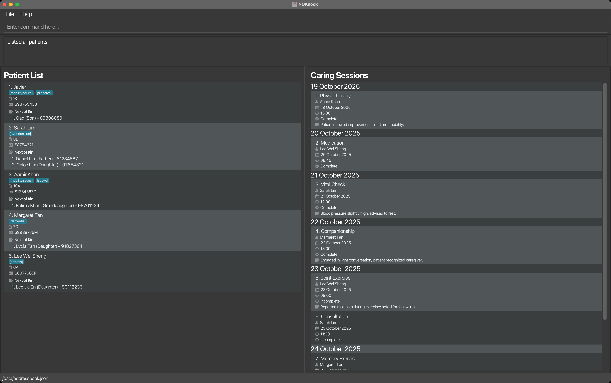

# NOKnock

This is a CLI-based nursing home management system for tracking patients, their Next-of-Kin (NOK) contacts, and caring sessions. Designed for nursing home staff who prefer command-line interfaces for fast, efficient daily operations.

Example usages:
* Track patients and their contact information
* Add information on their NOK.
* Add care session information

Software Engineering Practices:
  * It is **written in OOP fashion**. It provides a **reasonably well-written** code base **bigger** (around 6 KLoC) than what students usually write in beginner-level SE modules, without being overwhelmingly big.
  * It comes with a **great level of user and developer documentation**.

Trivia:
* It is named NOKnock as a play on words referencing traditional door-to-door provision of palliative healthcare.

This project is based on the AddressBook-Level3 project created by the [SE-EDU initiative](https://se-education.org).