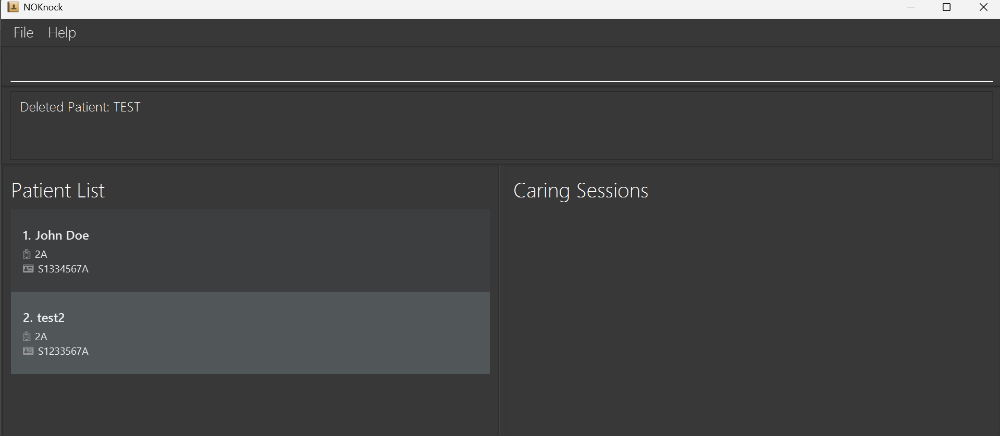
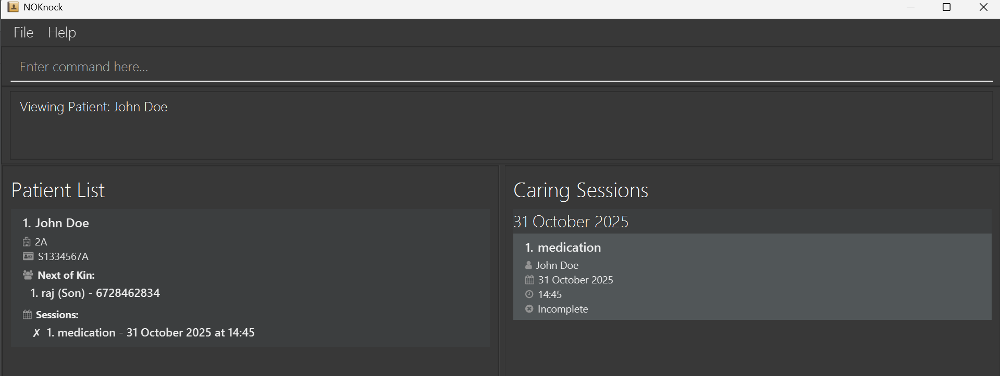
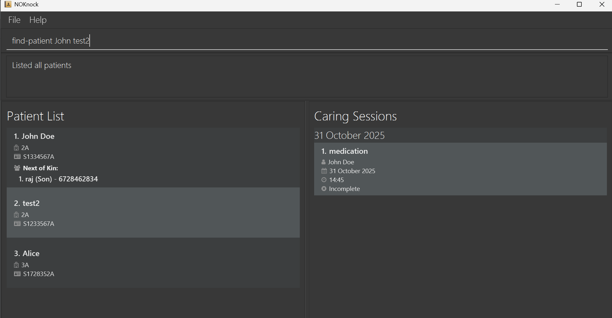
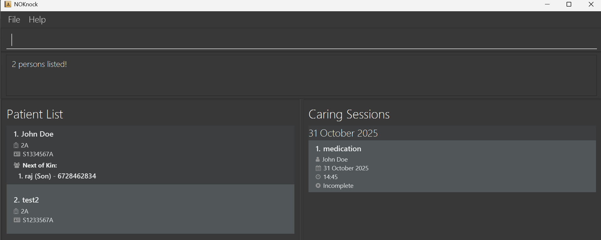

# NOKnock User Guide

<!--* Table of Contents -->
## Table of Contents
- [Introduction](#introduction)
    - [What is NOKnock?](#what-is-noknock)
    - [Who is This Guide For?](#who-is-this-guide-for)
    - [Why a CLI-first app (and how NOKnock is different)](#why-a-cli-first-app-and-how-noknock-is-different)
- [Quick start](#quick-start)
    - [System requirements](#system-requirements)
    - [Getting Java 17](#getting-java-17)
    - [Setting up](#setting-up)
    - [5-minute tutorial](#5-minute-tutorial)
- [Features](#features)
    - [Viewing help](#viewing-help--help)
- [Patient Management](#patient-management)
    - [Listing all patients](#listing-all-patients-list-patients)
    - [Adding a patient](#adding-a-patient-add-patient)
    - [Editing a patient](#editing-a-patient-edit-patient)
    - [Deleting a patient](#deleting-a-patient-delete-patient)
    - [Viewing patient details](#viewing-patient-details-view-patient)
    - [Finding patients by name](#finding-patients-by-name-find-patient)
    - [Finding patients by NOK name](#finding-patients-by-nok-name-find-by-nok)
- [Next-of-Kin (NOK) Management](#next-of-kin-nok-management)
    - [Adding a NOK](#adding-a-nok-add-nok)
    - [Editing a NOK](#editing-a-nok-edit-nok)
    - [Deleting a NOK](#deleting-a-nok-delete-nok)
- [Caring Session Management](#caring-session-management)
    - [Adding a session](#adding-a-session-add-session)
    - [Editing a session](#editing-a-session-edit-session)
    - [Deleting a session](#deleting-a-session-delete-session)
    - [Viewing today’s sessions](#viewing-todays-sessions-sessions-today)
    - [View this week’s sessions](#view-this-weeks-sessions-sessions-week)
- [Data Management](#data-management)
    - [Saving the data](#saving-the-data)
    - [Editing the data file](#editing-the-data-file)
- [FAQ](#faq)
- [Known issues](#known-issues)
- [Command Summary](#command-summary)

<page-nav-print />


# Introduction
## What is NOKnock?
Do you have trouble keeping track of the care your patients need? Do you wish that you didn't have to go through entire Excel sheets whenever you need to contact a patient's family? We've got the solution!

NOKnock! Who's there? NOKnock is a fast :runner:, keyboard-driven :musical_keyboard: app for nursing homes to track patients, their Next‑of‑Kin (NOK) contacts, and caring sessions. It is optimized for day-to-day floor operations where speed :clock1:, accuracy :round_pushpin:, and auditability matter more than complex GUIs. All it takes is the ability to type short commands! :satisfied:

## Who is This Guide For?

- You are a nursing home staff member (nurse, care aide, coordinator, or supervisor) who:
    - is comfortable typing short commands or following copy‑paste instructions.
    - may have little or no prior CLI experience. No scripting knowledge is required.
    - wants a reliable, offline tool that works consistently across different computers.
- If you prefer point‑and‑click only, you can still use NOKnock’s GUI window, but the fastest workflow uses commands.

<box type="tip" seamless>
New to the command line? You can copy each command from this guide and paste it into NOKnock’s command box. Start with the “5‑minute first task” below to get confident quickly.
</box>

---

## Why a CLI-first app (and how NOKnock is different)

- Speed and consistency: Commands are quicker than navigating menus, especially for repetitive tasks (add → edit → schedule).
- Fewer errors: A structured command format reduces ambiguity and helps prevent duplicate or inconsistent records.
- Works offline: All data stays on your machine in a simple JSON file—no internet required.
- Purpose‑built for nursing homes: Built‑in linkage between Patient ⇄ NOK ⇄ Caring Sessions fits actual eldercare workflows.
- Lightweight and portable: A single .jar file you can run on any machine with Java 17+.

How it compares:
- Versus spreadsheets: NOKnock enforces structure (unique IDs, linked NOKs/sessions), searchable lists, and date/time‑aware scheduling.
- Versus GUI‑only tools: Keyboard‑first commands make bulk operations and day‑to‑day updates much faster once you get the hang of it.

---

# Quick start

1. Ensure you meet the [system requirements](#system-requirements) and have Java `17` — see [Getting Java 17](#getting-java-17).
2. [Set up the app](#setting-up).
3. Type commands — follow the [5‑minute first task](#5-minute-tutorial) to try the core workflow.
4. Refer to the [Features](#features) below for details of each command.

---

## System requirements

- Operating system:
    - Windows 10 or 11 (x64)
    - macOS 12+ (Intel or Apple Silicon)
    - Linux (e.g., Ubuntu 20.04+/Debian 11+/Fedora 36+) with glibc compatible with Java 17
- Java: JDK/JRE 17 or newer 
- Disk: ~200 MB free (app + data headroom)
- Permissions: Write access to the folder containing the .jar (for saving data to data/noknock.json)
- Network: Not required (online access only needed to download Java/app updates)

---

## Getting Java 17

Choose one of the following:

- Windows: https://se-education.org/guides/tutorials/javaInstallationWindows.html
- macOS: https://se-education.org/guides/tutorials/javaInstallationMac.html
- Linux: https://se-education.org/guides/tutorials/javaInstallationLinux.html

<box type="info" seamless>
If <code>java -version</code> doesn’t work, restart your terminal or computer, then try again. If it still fails, reinstall Java using the links above.
</box>

---

## Setting up

1. Download the latest `.jar` file from the Releases page:
   https://github.com/AY2526S1-CS2103T-W09-2/tp/releases

2. Choose (or create) a folder to act as your NOKnock home folder, and copy the `.jar` file into it.

3. Open a command terminal and change into that folder:
    - Windows (PowerShell):
      ```
      cd "C:\path\to\your\NOKnock"
      java -jar noknock.jar
      ```
    - macOS/Linux (Terminal):
      ```
      cd ~/NOKnock
      java -jar noknock.jar
      ```

4. A GUI should appear within a few seconds. The app starts with sample data so you can try commands immediately.

   

---

## 5-minute tutorial

Follow this quick walkthrough to learn the core workflow. Copy each command into NOKnock’s command box and press Enter.

1) List current patients (to see indexes)
~~~
list-patients
~~~

2) Add a new patient
~~~
add-patient n/Aisha Tan ic/S1234567A w/2A t/diabetes
~~~
Expected:
~~~
Patient added: Aisha Tan (S1234567A)
~~~

3) Find your patient’s index (since sample data may exist)
~~~
find-patient aisha
~~~
Note the Index shown for “Aisha Tan” (e.g., 5). Use that number in the next commands instead of X.

4) Add a Next‑of‑Kin for that patient (replace X with Aisha’s index)
~~~
add-nok X n/Daniel Tan p/+6598765432 r/son
~~~
Expected:
~~~
NOK added for Aisha Tan: Daniel Tan (son, +6598765432)
~~~

5) Schedule a caring session (replace X; adjust date/time as needed)
~~~
add-session X d/2025-11-01 time/09:30 type/medication notes/Metformin 500mg
~~~
Expected:
~~~
Caring session added for Aisha Tan: medication on 2025-11-01 at 09:30
~~~

6) View the full patient profile
~~~
view-patient 1
~~~
You’ll see Aisha’s details, linked NOK(s), and upcoming sessions in one place.

7) Optional: See today’s sessions
~~~
sessions-today
~~~
Tip: If you want the session to appear here, schedule one with today’s date.

<box type="tip" seamless>
Made a typo? Use <code>edit-patient</code>, <code>edit-nok</code>, or <code>edit-session</code> to update fields; or the <code>delete-*</code> commands to remove entries. See Features below for full command formats and options.
</box>

---

## Features

<box type="info" seamless>

**Notes about the command format:**<br>

* Words in `UPPER_CASE` are parameters to be filled by the user.<br>
  e.g. `add-patient n/NAME ic/IC_NUMBER w/WARD → add-patient n/Dylan ic/S1234567A w/2A`

* Items in square brackets `[ ]` are optional.<br>
  e.g. `add-patient n/NAME ic/IC_NUMBER [t/TAG]` can be used with or without `t/TAG`.

* Items with `...` can appear multiple times (including zero if the item is optional).<br>
  e.g. `[t/TAG]...` → no tags, one tag, or many tags.

* Parameters can be in any order.<br>
  e.g. `n/NAME w/WARD ic/IC_NUMBER` = `ic/IC_NUMBER w/WARD n/NAME`.

* Additional parameters for commands that do not accept them will be ignored.<br>
  e.g. `help abc` = `help`.

* All of the commands are 1 indexed. E.g. `delete-patient 1` means deleting the first person.

* If you are using a PDF version of this document, be careful when copying and pasting commands that span multiple lines as space characters surrounding line-breaks may be omitted when copied over to the application.

</box>

### Viewing help : `help`

Shows a message explaining how to access the help page.


**Format:**
`help`

---

## Patient Management

### Listing all patients: `list-patients`

Displays all patients with basic information.

**Format:**  
`list-patients`

**Output:**

* Success → Table with Index, Name, IC, Ward, Tags, NOK List, Caring Session List
* None → `No patients in the system`
<br/><br/>
  

### Adding a patient: `add-patient`

Creates a new patient record.

**Format:**  
`add-patient n/NAME ic/IC_NUMBER w/WARD [t/TAG]...`

**Examples:**

* `add-patient n/Dylan w/2A ic/S1234567A`
* `add-patient n/Javier w/8B ic/S9876543B t/diabetes t/mobility-issues`

💡 **Tip:** You can always enter the command phrase to be prompted the right usage of commands


❌ **Common mistakes**: It is common for one to enter the orders of fields wrongly.
<box type="error">
E.g.add-patient n/Amy ic/S1234567A w/2A
</box>

<box type="tip" seamless>

**Note:** Tags are optional and can be used to describe medical or care-related info.

</box>

**Output:**

* Success → `Patient added: Dylan (S1234567A)`
* Duplicate → `Patient with IC S1234567A already exists`
* Invalid input → parameter-specific error message

### Editing a patient: `edit-patient`

Updates an existing patient’s information. At least one field must be provided.

**Format:**  
`edit-patient INDEX [n/NAME] [ic/IC_NUMBER] [w/WARD] [t/TAG]...`

**Examples:**

* `edit-patient 1 n/Yue Yang`
* `edit-patient 2 t/diabetes t/wheelchair`

**Output:**

* Success → `Patient updated: Yue Yang (S1234567A)`
* Invalid index → `Patient index X is out of range`
* Duplicate IC → `This patient already exists in the address book`

❌ **Possible mistake**: `edit-patient 1` is incorrect because no field was provided.
### Deleting a patient: `delete-patient`

Removes a patient and all associated data (NOKs, sessions).

**Format:**  
`delete-patient INDEX`

**Example:**  
`delete-patient 1`

**Output:**

* Success → `Patient deleted: Yue Yang (S1234567A)`
* Failure → `Patient not found at index X`

<box type="warning" seamless>

**Caution:** Deleting a patient also deletes all related NOK and caring session data.

</box>

<box type="tip" seamless>

⚠️ Tip: Once the first person is deleted, the original second person becomes the first. To delete first N patients,
use the `delete-patient 1` command for N times


</box>
### Viewing patient details: `view-patient`

Shows full patient details including NOKs and upcoming sessions.

**Format:**  
`view-patient INDEX`

**Example:**  
`view-patient 2`

**Output:**

* Success → Full profile with NOK list and upcoming sessions
* Failure → `Patient not found at index X`

### Finding patients by name: `find-patient`

Search for patients by name (case-insensitive, partial matching).

**Format:**  
`find-patient KEYWORD [MORE_KEYWORDS]...`

**Examples:**

* `find-patient dylan`
* `find-patient javier wong`

**Output:**

* Success → `2 patient(s) found:` + list
* None → `No patients found matching: javier wong`
⚠️ Tip: You can enter multiple keywords(capitalised or non-capitalised is fine) to find more than 1 patient. E.g


❗ **Common error**: keywords must match at least 1 word in patient's name. A prefix will not yield
any result.
### Finding patients by NOK name: `find-by-nok`

Search for patients based on their NOK’s name.

**Format:**  
`find-by-nok KEYWORD [MORE_KEYWORDS]...`

**Examples:**

* `find-by-nok oad`
* `find-by-nok javier smith`

**Output:**

* Success → `1 patient(s) found (via NOK search):` + list
* None → `No patients found with NOK matching: oad`

---

## Next-of-Kin (NOK) Management

### Adding a NOK: `add-nok`

Adds a Next-of-Kin contact for a patient.

**Format:**  
`add-nok PATIENT_INDEX n/NAME p/PHONE r/RELATIONSHIP`

**Examples:**

* `add-nok 1 n/Oad p/+6598765432 r/son`
* `add-nok 2 n/Dr. Kapikapi p/+656234-5678 r/doctor`

**Output:**

* Success → `NOK added for Dylan: Oad (son, +6598765432)`
* Duplicate → `NOK with same name and phone already exists for this patient`

⚠️ **Tip**: you can always use the `list-patient` command to see the list of patients before deciding which patient the
nok should be added to.

After adding a patient, you should see something similar to the picture below

### Editing a NOK: `edit-nok`

Updates NOK details.

**Format:**  
`edit-nok PATIENT_INDEX NOK_INDEX [n/NAME] [p/PHONE] [r/RELATIONSHIP]`

**Example:**  
`edit-nok 1 1 p/+6588888888`

**Output:**

* Success → `NOK updated for Dylan: Oad (son, +6588888888)`
* Failure → `Patient/NOK not found`

### Deleting a NOK: `delete-nok`

Removes a NOK from a patient.

**Format:**  
`delete-nok PATIENT_INDEX NOK_INDEX`

**Example:**  
`delete-nok 1 2`

**Output:**

* Success → `NOK deleted for Dylan: Oad Smith`
* Failure → `Patient/NOK not found`

---

## Caring Session Management

### Adding a session: `add-session`

Schedules a care session for a patient.

**Format:**  
`add-session PATIENT_INDEX d/DATE time/TIME type/CARE_TYPE [notes/NOTES]`

**Examples:**

* `add-session 1 d/2024-12-25 time/14:30 type/medication notes/Give insulin shot`
* `add-session 2 d/25-12-2024 time/2:30pm type/hygiene`

**Output:**

* Success → `Caring session added for Dylan: medication on 2024-12-25 at 14:30`
* Failure → parameter-specific error (e.g. invalid date/time)

### Editing a session: `edit-session`

Edit an existing care session for a patient. You may also update the session status (`complete` or `incomplete`).

**Format:**
`edit-session PATIENT_INDEX SESSION_INDEX [d/DATE] [time/TIME] [type/CARE_TYPE] [notes/NOTES] [status/STATUS]`

**Examples:**

* `edit-session 1 2 d/2024-12-25 t/14:30 type/medication notes/Adjust dose status/complete`
* `edit-session 2 1 status/incomplete`

**Output:**

* Success -> `Session updated: Dylan - medication - 2024-12-25 14:30 (complete)`
* Failure -> parameter-specific error (e.g. invalid date/time or indices)

⚠️ **Tip**: To get a better view of the caring session for a specific patient before editing, use `view-patient`
command. 
E.g. To edit a session of first patient, limit the caring sessions view to that of the first patient only


### Deleting a session: `delete-session`

Deletes a care session from a patient.

**Format:**  
`delete-session PATIENT_INDEX SESSION_INDEX`

**Example:**
`delete-session 1 2`

**Output:**

* Success → `Caring session deleted for Dylan: medication on 2024-12-25 at 14:30`
* Failure → `Patient/Session not found`

### Viewing today’s sessions: `sessions-today`

Displays all caring sessions scheduled for today.

**Format:**  
`sessions-today`

**Output:**

* Success → `Today's caring sessions (2025-10-22):` + list
* None → `No caring sessions scheduled for today`

### View this week’s sessions: `sessions-week`

Displays all caring sessions scheduled for the current week (Monday to Sunday).

**Format:**  
`sessions-week`

**Output:**

* Success → `This week's caring sessions (2025-10-20 to 2025-10-26):` + list
* None → `No caring sessions scheduled for this week`

---

## Data Management

### Saving the data

NOKnock data are saved in the hard disk automatically after any command that changes the data. There is no need to save manually.

### Editing the data file

NOKnock data are saved automatically as a JSON file `[JAR file location]/data/noknock.json`. Advanced users are welcome to update data directly by editing that data file.

<box type="warning" seamless>

**Caution:** If your changes to the data file makes its format invalid, NOKnock will discard all data and start with an empty data file at the next run. Hence, it is recommended to take a backup of the file before editing it.

Furthermore, certain edits can cause the NOKnock to behave in unexpected ways (e.g., if a value entered is outside the acceptable range). Therefore, edit the data file only if you are confident that you can update it correctly.

</box>

---

## FAQ

**Q**: How do I transfer my data to another Computer?<br>
**A**: Install the app in the other computer and overwrite the empty data file it creates with the file that contains the data of your previous NOKnock home folder.

**Q**: Which files do I copy when migrating to another computer?<br>
**A**: Copy the entire `data` folder (especially `data/noknock.json`) from your old NOKnock home folder to the same location beside the `.jar` on the new machine. Optionally copy `preferences.json` to keep window size/position and UI settings.

**Q**: Where is my data stored?<br>
**A**: By default, in `[JAR folder]/data/noknock.json`. Preferences are saved in `[JAR folder]/preferences.json`.

**Q**: How do I back up and restore my data?<br>
**A**: Close the app, then copy `data/noknock.json` to a safe location. To restore, replace the existing `data/noknock.json` with your backup (while the app is closed).

**Q**: Can I change where data is saved?<br>
**A**: Not currently. Data is stored next to the `.jar` in `data/noknock.json`. To move the data, move the `.jar` and the `data` folder together to a new location.

**Q**: How do I update to a new version without losing data?<br>
**A**: Download the new `.jar` and place it in the same folder as your existing `data` folder. Keep the folder structure intact. You can rename the new file to `noknock.jar` or use the versioned file name when running `java -jar`.

---

## Known issues

1. **When using multiple screens**, if you move the application to a secondary screen, and later switch to using only the primary screen, the GUI will open off-screen. The remedy is to delete the `preferences.json` file created by the application before running the application again.
2. **If you minimize the Help Window** and then run the `help` command (or use the `Help` menu, or the keyboard shortcut `F1`) again, the original Help Window will remain minimized, and no new Help Window will appear. The remedy is to manually restore the minimized Help Window.

---

## Command Summary

| **Action**                                                      | **Format / Example**                                                                                                                                                                      |
|-----------------------------------------------------------------|-------------------------------------------------------------------------------------------------------------------------------------------------------------------------------------------|
| [**List Patients**](#listing-all-patients-list-patients)        | `list-patients`                                                                                                                                                                           |
| [**View Patient**](#viewing-patient-details-view-patient)       | `view-patient INDEX`                                                                                                                                                                      |
| [**Add Patient**](#adding-a-patient-add-patient)                | `add-patient n/NAME ic/IC_NUMBER w/WARD [t/TAG]...`<br>e.g. `add-patient n/Dylan ic/S1234567A w/2A t/diabetes`                                                                            |
| [**Edit Patient**](#editing-a-patient-edit-patient)             | `edit-patient INDEX [n/NAME] [w/WARD] [ic/IC_NUMBER] [t/TAG]...`<br>e.g. `edit-patient 1 n/Yue Yang`                                                                                      |
| [**Delete Patient**](#deleting-a-patient-delete-patient)        | `delete-patient INDEX`<br>e.g. `delete-patient 2`                                                                                                                                         |
| [**Add NOK**](#adding-a-nok-add-nok)                            | `add-nok PATIENT_INDEX n/NAME p/PHONE r/RELATIONSHIP`<br>e.g. `add-nok 1 n/Oad p/+6598765432 r/son`                                                                                       |
| [**Edit NOK**](#editing-a-nok-edit-nok)                         | `edit-nok PATIENT_INDEX NOK_INDEX [n/NAME] [p/PHONE] [r/RELATIONSHIP]`<br>e.g. `edit-nok 1 1 p/+6588888888`                                                                               |
| [**Delete NOK**](#deleting-a-nok-delete-nok)                    | `delete-nok PATIENT_INDEX NOK_INDEX`                                                                                                                                                      |
| [**Add Caring Session**](#adding-a-session-add-session)         | `add-caring-session PATIENT_INDEX d/DATE t/TIME type/CARE_TYPE [notes/NOTES]`<br>e.g. `add-caring-session 1 d/2024-12-25 t/14:30 type/medication notes/Give insulin shot`                 |
| [**Edit Caring Session**](#editing-a-session-edit-session)      | `edit-caring-session PATIENT_INDEX SESSION_INDEX [d/DATE] [t/TIME] [type/CARE_TYPE] [notes/NOTES] [status/STATUS]`<br>e.g. `edit-caring-session 1 2 d/2024-12-25 t/14:30 status/complete` |
| [**Delete Caring Session**](#deleting-a-session-delete-session) | `delete-caring-session PATIENT_INDEX SESSION_INDEX`<br>e.g. `delete-caring-session 1 2`                                                                                                   |
| [**Sessions Today**](#viewing-todays-sessions-sessions-today)   | `sessions-today`                                                                                                                                                                          |
| [**Sessions Week**](#view-this-weeks-sessions-sessions-week)    | `sessions-week`                                                                                                                                                                           |
| [**Help**](#viewing-help--help)                                 | `help`                                                                                                                                                                                    |
| **Exit**                                                        | `exit`                                                                                                                                                                                    |